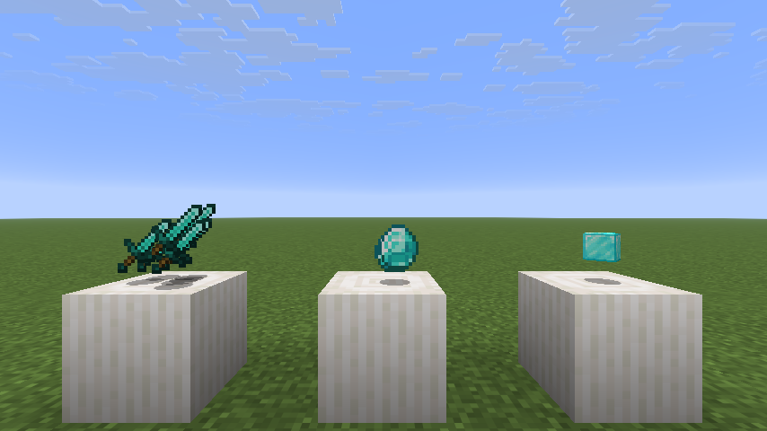

# Flat Items

This mod renders items as flat, like in older versions of the game. It's a rewrite of [Noryea's](https://github.com/noryea) mod [Fast Items](https://github.com/Noryea/fast-items).

## Settings

These settings can be changed in-game with NeoForge's config screen or with [Mod Menu](https://modrinth.com/mod/modmenu) in Fabric.

_`enabled` / Render Items as Flat_: Enables/disables the mod.

_`affect_3d` / Affect 3D Models_: Determines whether 3D models like blocks will also be display as flat.

_`render_sides` / Render Sides of Items_: Renders the sides of items whilst still making them face the player. Makes for a nice, subtle 3D effect!